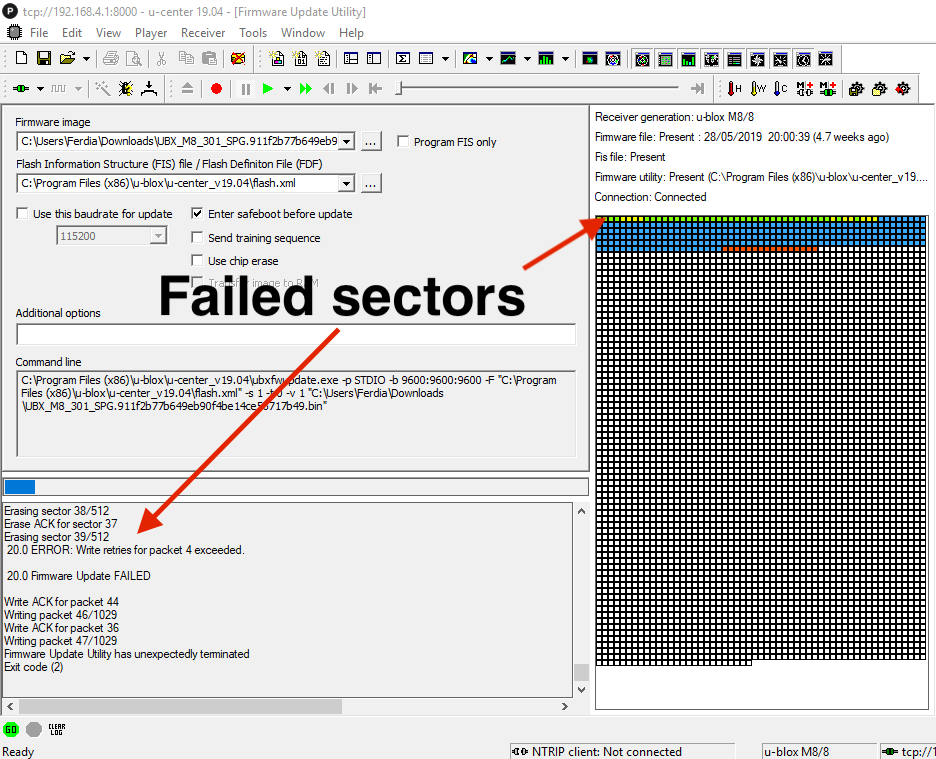
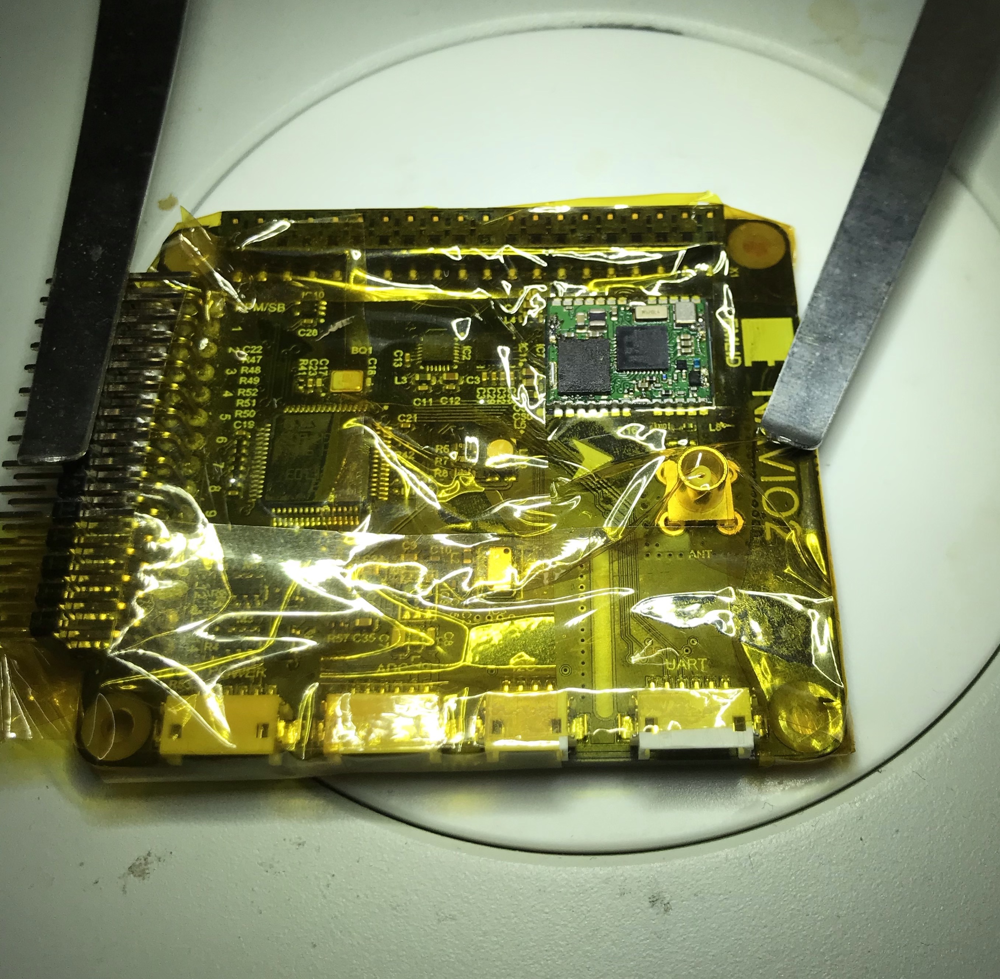
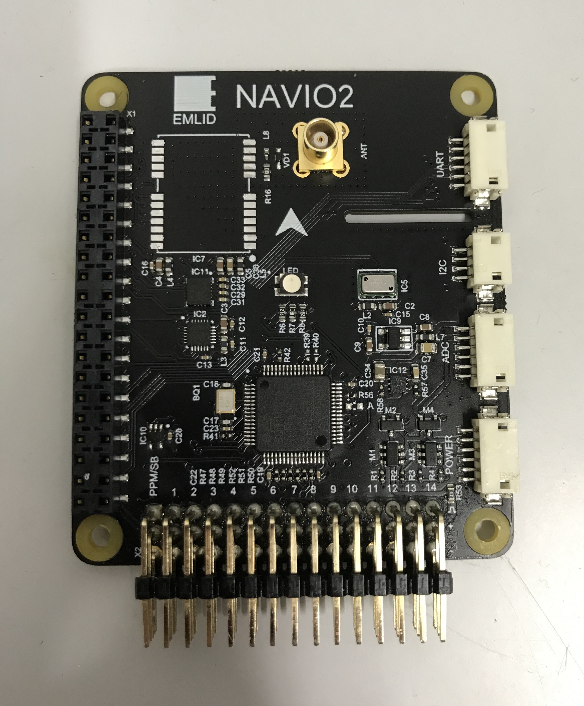

+++
title = "Galileo constellation support on the Navio2"
date = 2019-07-07
+++

The [Navio2]() is a daughterboard for the Raspberry Pi 2/3 that allows you to use the Pi for robotics projects. It contains an array of sensors and IO, including IMUs, a barometer, and a GPS module. A [u-blox NEO-M8N module]() to be exact. This GPS module was produced initially with a version 2 firmware which supported [GPS and GLONASS](), and later a version 3 which added [Galileo]() support. Unfortunately the Navio2 board that I had only had version 2. Being the upstanding European citizen that I am, I felt it my duty, nae my *responsibility* to fiddle with the module until I could use that satellite constellation.

And so fiddle I did.

I began by using u-blox [u-center]() and the tool in the [Navio2 software repository]() that opens up a connection to the module over TCP. I connected, and to my horror saw the long list of American and Russian flags fill my screen. I tried following [this guide]() for updating the firmware, but strangely I was getting the following error:

Oh dear. Retrying resulted in the same issue; my assumption was that it was an issue with the flash chip on the module. I had a second M8N and it's in a ... package, so I assumed this would be a straightforward swap. I covered the board in Kapton tape so as to not damage anything, and remove the metal shield from the M8N module.

I applied a generous amount of flux and heat, then gently removed the u-blox chip. I cleaned the excess solder from the pad with copper wick and more flux.

