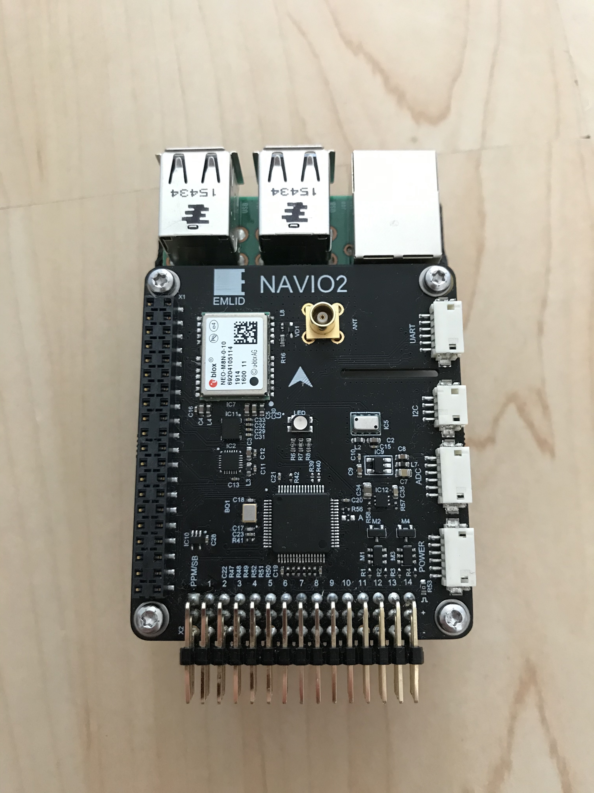
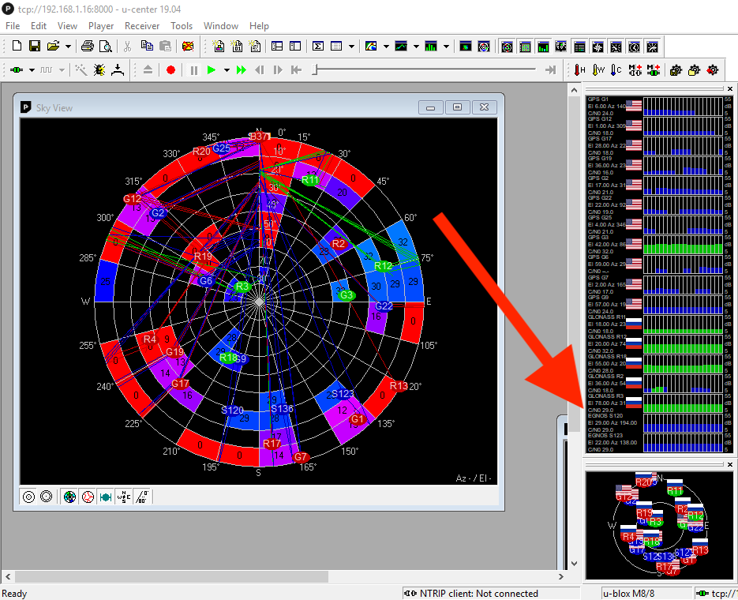

+++
title = "Galileo constellation support on the Navio2"
date = 2019-07-07
+++

The [Navio2](https://emlid.com/navio/) is a daughterboard for the Raspberry Pi 2/3 that allows you to use the Pi for robotics projects. It contains an array of sensors and IO, including IMUs, a barometer, and a GPS module. A [u-blox NEO-M8N module](https://www.u-blox.com/en/product/neo-m8-series) to be exact. This GPS module was produced initially with a version 2 firmware which supported [GPS](https://en.wikipedia.org/wiki/Global_Positioning_System) and [GLONASS](https://en.wikipedia.org/wiki/GLONASS), and later a version 3 which added [Galileo](https://en.wikipedia.org/wiki/Galileo_(satellite_navigation)) support. Unfortunately the Navio2 board that I had only had version 2. Being the upstanding European citizen that I am, I felt it my duty, nae my *responsibility* to fiddle with the module until I could use that satellite constellation.

And so fiddle I did.

I began by using u-blox [u-center](https://www.u-blox.com/en/product/u-center) and the tool in the [Navio2 software repository](https://github.com/emlid/Navio2) that opens up a connection to the module over TCP. I connected, and to my horror saw the long list of American and Russian flags fill my screen. I tried following [this guide](http://www.rei-labs.net/how-to-update-neo-m8n-firmware/) for updating the firmware, but I got the following error regarding bad sectors:

Oh dear. Retrying didn't help; my assumption was that it was an issue with the flash chip on the module. [This guide](https://www.schurich.com/2018/02/ublox-flash-upgrade/) indicated it was possbile, and I had a second M8N I could use as a donor. I covered the board in Kapton tape so as to not damage anything, and removed the metal shield from the M8N module.

I applied a generous amount of flux and heat, then gently removed the u-blox chip. I cleaned the excess solder from the pad with copper wick and more flux.

I repeated the process for the donor GPS unit, then attempted to swap the chips before failing miserably. I applied too much heat which would've been fine until my hand slipped and I knocked the tiny SMD components off the module.

*Sigh*

I decided the best way forward would be to just buy a new module. So that's what I did. I cleaned up the board:

And soldered the new one in its place, then mounted the board on a Pi3.

Aaaaand.

Boom. Galileo satellites. Completely worth it.
