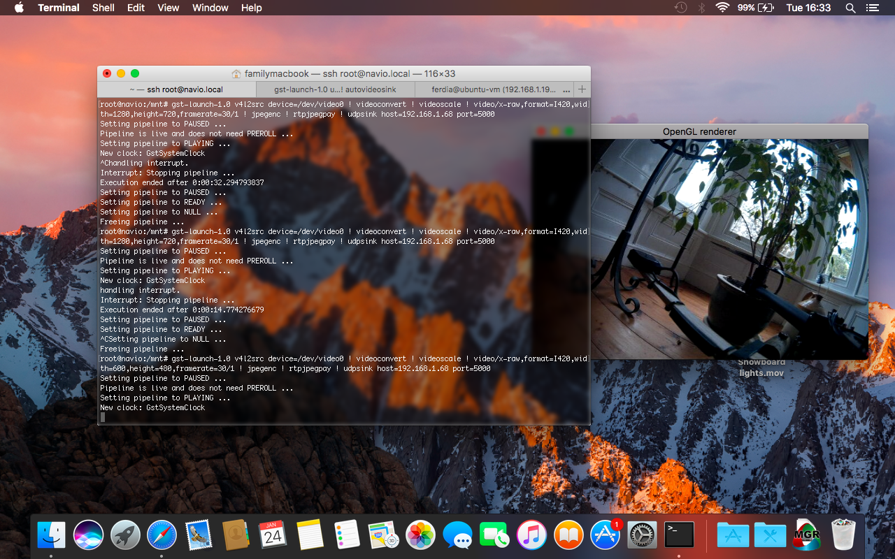
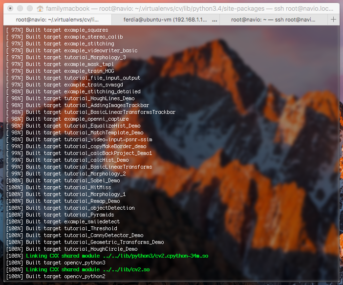
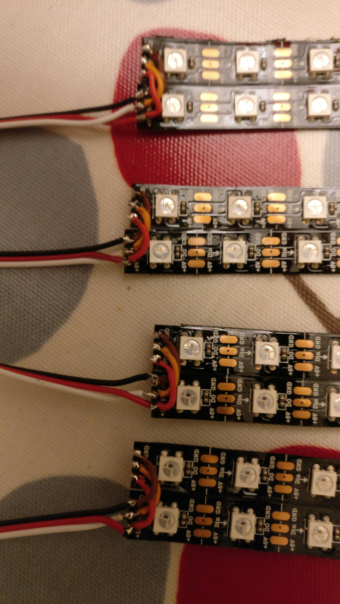

<iframe src='https://gfycat.com/ifr/WaterloggedLikelyFinch' frameborder='0' scrolling='no' width='640' height='360' allowfullscreen></iframe>

I am currently developing a multi-rotor unmanned aircraft system (UAS) to be used in search and rescue operations using object recognition to find a target and deliver a payload, e.g. to help an injured climber on traditionally inaccessible terrain needing to be dropped fluids, a torch, an insulating blanket and/or a flare to assist their survival and later rescue.

The onboard computer is a Raspberry Pi 3 with a Navio2 board. The Pi uses Emlid's Raspbian image with a modified kernel for realtime support necessary to run the ArduPilot flight stack. It runs an OpenCV program for object recognition and GStreamer to send live, processed video to the ground station. The 3DR Dronekit API is used for communication between the object recognition software and the ArduCopter process.

The airframe is a Quadframe PRO-X8 with only 4 motors installed and room for another 4 to increase maximum payload capacity, stability and redundancy. I am using MT2814-10 770KV motors, 13x4.8 carbon propellers, Turnigy 30A Plush ESCs with BLHeli firmware and a 4s 16Ah Lithium Polymer battery. The GPS unit and X8R receiver are mounted on a balsa spar. The flight time is 15-20 mins and has a top speed of 60MPH.

A Mobius camera was installed on the side of the centre hub, and I soldered a short Mini-USB connector to connect to the Raspberry Pi for input to GStreamer and OpenCV. Only a resolution of 600x480 was low enough to get a reasonable framerate on the limited bandwidth available.

I attempted to cross-compile OpenCV on my Ubuntu virtual machine but when I tried to copy the directory across to the Pi, "make install" failed and was not fixed by modifying the working directories in the cmake files. So I had to compile everything on the Pi, which took roughly 2-3 hours as it kept crashing, but would work and continue if restarted.

I then added an additional telemetry flag in /etc/default/arupilot for the localhost address to be used by the DroneKit API. A quick python script later, and it was working!

The pre-trained pedestrian detection for OpenCV was working great with what type of image I assume it was designed for: close, eye-level, high resolution pictures.

But it was completely failing at detecting pedestrians in images taken from above: I used some stock photographs taken slightly above head height with poor results, and no detection ever with top down images. One solution, I believe, will be to train my own Haar classifier. I can record videos with the installed camera and (hopefully) generate several thousand positive and negative samples by walking underneath the UAS when in flight.

In the meantime, I added a WiFi access point to the UAS. Using the mavesp8266 firmware on a NodeMCU v2, MAVLink telemetry data is passed through a serial connection over WiFi to UDP packets on port 14550 for computer GCS software. I am using a FT4232H module to give the Pi 4 UART ports through a single USB port.

As a faster demonstration of it's capabilities, I wrote a Python script to locate my red binder. It takes frames from the Mobius camera, converts them to the HSV colour space, and then applies a mask to only leave the desired item left in the frame.

Once this is done, a centre can be detected and text and shapes drawn.

It uses DroneKit to takeoff, fly to a height of 1.5m, then calculates velocity data based on the position of the detected object in the frame and sends a command over a software Mavlink connection. Once I have the time to train a Haar classifier it will be very easy to modify the code.

I also installed a set of LEDs for user orientation and feedback, and also for illuminating the ground at when searching at night. Two strips of 12 lights were attached to a piece of double-sided foam tape, and the ends were soldered in parallel to simplify the wiring as I couldn't see a situation where they would need to be different colours.

The lights are controlled using the rpi_ws281x library on GPIO18 (Pin 4 of the serial port on the Navio2) and powered on a separate Polulu 5V 5A regulator to prevent any failure affecting the rest of the power delivery system.

