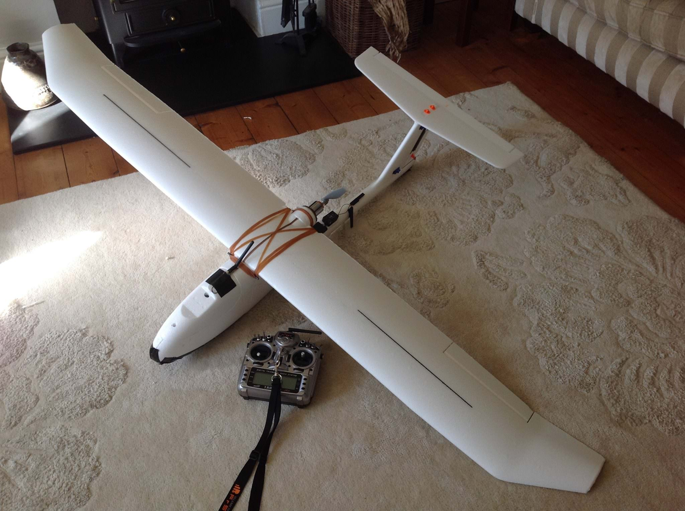
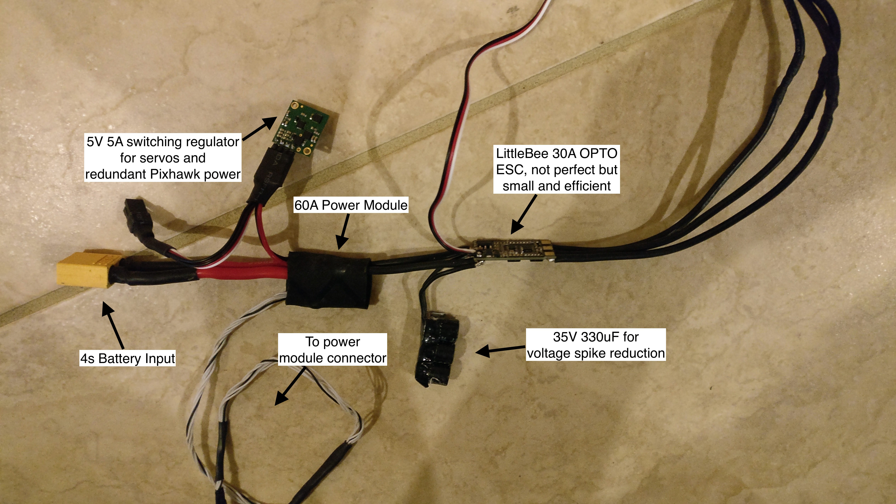

+++
title = "Long Range UAS"
date = 2016-11-17
hero = "/images/long-range-uas.jpg"
+++

My latest build is a Pixhawk Skywalker 1900 UAV. It has a wingspan of 1.9m, and uses a 4s 16000mAh battery.

The plane is outfitted with a 1.3GHz 800mW video transmitter, minimOSD and Skew Planer antenna.

My current record is a 3h14m flight completely autonomous, from take off to landing. I have been able to fly at 350M AGL drawing only 3.4 amps, showing at least 4 hours is possible on this platform with further work.

Here is the Pixhawk, mounted in the upper space, leaving just the battery, switching regulator and speed controller in the main cavity. I plan on lining the top of the main space with aluminium or copper foil in order to shield the more sensitive electronics above.

The RC receiver is an L9R from FrSky. The antennae are mounted like so in order to avoid drop-outs when banking for a turn. I have had no issues with range, but have not tested distances >5KM. So far I just have SBUS output going to the Pixhawk, but I will install a second wire for RSSI soon.

Finally, here is the annotated power system for the aircraft.

Update 22-11-2016:

Here is the video from a late Sunday afternoon flight. Loiter and FBWA modes were tested and found to be working.

<iframe width="640" height="360" frameborder="0"
src="https://www.youtube.com/embed/kTL57gh8xlw">
</iframe>

