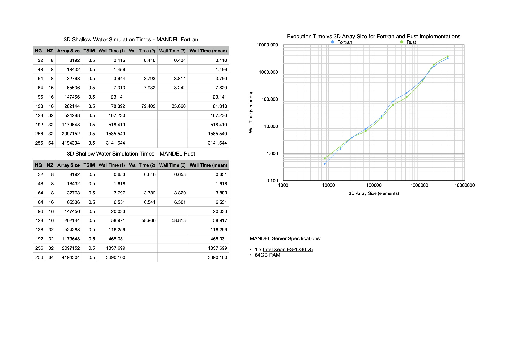

### [github.com/rse-standrewscs/shallow-water](https://github.com/rse-standrewscs/shallow-water)

TL;DR: Rewriting isn't *always* bad, [Amdahl’s Law](https://en.wikipedia.org/wiki/Amdahl%27s_law) is important and memory bandwidth is a potential bottleneck when doing many simple double precision math operations

## Introduction

As part of an Undergraduate Research Assistant Scheme in my first year of university I was tasked with parallelising a piece of shallow water simulation software written in FORTRAN by Dr David Dritschel of the Vortex Dynamics Research Group, under supervision of Dr. Alexander Konovalov, at the University of St Andrews. There were secondary goals such as improving the testing infrastructure, setting up CI/CD, estimating progress and allowing the computation to be paused and resumed.

Forewarning: I have essentially zero domain knowledge in this project (and fluid dynamics simulation isn’t exactly the kind of topic you can catch up to research level on over a weekend) so I approached this project from a purely software engineering perspective. As for my Rust experience, I've been using it for personal projects since ~2016 and I worked as a Rust software engineer at a startup in Berlin for a year after leaving high school.

## Don’t Rewrite

[Don’t.](https://www.joelonsoftware.com/2000/04/06/things-you-should-never-do-part-i/)

[Rewrite.](https://understandlegacycode.com/blog/avoid-rewriting-a-legacy-system-from-scratch-by-strangling-it/)

[Legacy.](https://medium.com/better-programming/how-i-failed-to-deal-with-legacy-code-8e123cff5bce)

[Code.](https://daedtech.com/the-myth-of-the-software-rewrite/)

Not too hard a concept to grasp, is it? Not much ambiguity and a clear line of reasoning to follow as to why legacy software should not be rewritten. Well I read the articles written by people far more experienced and knowledgable than myself and thought:

<p align="center">

</p>

## Why *My* Situation is Different

All jokes aside, there are situations where a re-implementation is a reasonable option and I did have several factors to back me up.

FORTRAN is undoubtably *very* fast and highly suited to HPC problems with decades-optimised compilers and debugging tooling but it does lack certain features, namely memory safety, thread safety, data race guarantees and ergonomic GPU/CLI/TUI libraries.

Having written parallel software in both C and Rust, the memory safety guarantees and easy parallelisation with Rayon offered by Rust contrasts quite sharply with my poor experience using OpenMP. Replacing `.iter()` with `.par_iter()` and having the compiler automatically throw errors for any code that isn’t thread safe is amazing compared with adding OpenMP directive sentinels (designed to be hidden from a non OpenMP-compliant FORTRAN compiler) and manually determining thread and memory safety. Here seems a good a place as any to mention that ["~70% of the vulnerabilities Microsoft assigns a CVE each year continue to be memory safety issues"](https://msrc-blog.microsoft.com/2019/07/16/a-proactive-approach-to-more-secure-code/).

It was believed initially that GPUs could be used to accelerate the computation, ~another place where Rust’s (while not mature) ecosystem also shines above those offered for FORTRAN~ EDIT: completely untrue, FORTRAN's GPU acceleratin libraries are very mature and production ready. Additionally when it came to the additional requirements building a `ncurses` interface in FORTRAN isn’t exactly ergonomic compared with the libraries available in Rust. I spent some time reading through the original implementation and attempted some basic parallelisation with little success due to small errors being hard to diagnose across long executions without snapshot testing across multiple modules.

Not only was there several "pull" factors, but there was also the absence of the typical reasons you shouldn't rewrite: I was working as a one-person team, the software was finalised and so never needed to be modified again, it was relatively small so could be rewritten in a matter of months (part time) and is not a live business component so uptime and upkeep of the original implementation are irrelevant.

Given all of this I decided it would be faster to rewrite in Rust, then be able parallelise it and add features quickly than it would be to plough through with the FORTRAN, and with a go-ahead from my supervisor I got to work.

## Translating FORTRAN to Rust

*Relatively* straightforward translation of existing codebases in compiled languages to Rust is a noted benefit due to the combination of software like [C2Rust](https://c2rust.com) to perform automatic translation of C source into Rust, [bindgen](https://github.com/rust-lang/rust-bindgen) for automatically generating FFI bindings and of Cargo’s ability to compile code in other languages as part of a Rust project. While there are plenty examples of large projects successfully migrating to Rust this way, the issue I faced was that it would have required a two-step process, first translating from FORTRAN to C and then from C to Rust. I assumed the likelihood that the resulting code would be remotely parsable was very low and I couldn’t even get either of the most popular FORTRAN to C conversion tools to work.

Since the original implementation was only 6,000 lines total I decided to go with a manual translation. This involved starting at the base of the module tree with the Fast Fourier Transform routines and working upwards. I kept my process simple by inserting small pieces of FORTRAN to dump state at the beginning and end of routines which was then used for snapshot tests for the Rust implementation. This resulted in a thorough, robust testing suite which was invaluble during the optimization period. I really only made one bad design decision (please don't read through the git history to confirm this 😅) during the translation phase which was thinking that nested `Vec`s would be easier than using `ndarray` from the start. This was a Bad Decision™️ and wasted so much time, not only in the abysmal execution speeds slowing down `cargo test`, but also in that it significantly increased development time. I would replace a statement such as

```f90
! FORTRAN
a=a*b
```

with

```rust
// Awful, awful Rust
for i in 0..x {
	for j in 0..y {
		a[i][j] = a[i][j] * b[i][j]
	}
}
```

when the final `ndarray` version would look like

```rust
// Ergonomic Rust
a *= &b;
```

Clearly the intermediary step could have been skipped and a more direct translation was possible. I wrote a regex to replace FORTRAN array indexing syntax (`array(x,y,z)`) to nested `Vec`s in Rust (`array[x][y][z]`), when `ndarray` syntax (`array[[x,y,z]]`) would have been a far simpler conversion. If this decision wasn't bad enough, I also wasted time writing several functions to convert between a byte slice and the nested `Vec`s with the FORTRAN memory layout when `ndarray` has a built-in preset for FORTRAN shape and strides.

One issue that arose during testing was that due to the accumulation of small errors in floating point math, results would be slightly different between operating systems and hardware configurations which made the fantastic snapshot testing tool `insta` unsuitable. Instead `ndarray`’s `serde` and `approx` feature flags are used to read serialised arrays from disk to compare approximately during tests which has been working well.

## Optimizing

###  Parallelisation

Fundamentally the problem is not one that may be described as “embarrassingly parallel”, which was the assumption made going into the project (early discussions involved expectations of a 100x improvement on the university cluster). Ideally we would be want many large chunks of independent computation operating on a small amount of data, making it easy to distribute work across threads, GPUs and potentially different machines, but unfortunately I learned this problem is quite far from that ideal.

The outermost loop advances through time and is therefore strictly sequential, and in the primary function of the program (`src/nhswps/advance.rs:advance`) a large portion is iterated over twice, also strictly sequential. Some other lower-level functions perform operations on individual layers and so can be parallelised completely, but these are not generally very complex functions and so finish quickly before returning to sequential execution. [Amdahl’s Law](https://en.wikipedia.org/wiki/Amdahl%27s_law) comes into affect here, describing how even if everything that can be parallelised is, there are fundamental limits to the scaling we can ever achieve.

### Memory Bandwidth Issues

Throughout the program there are several kinds of operations being performed on the 2- and 3-dimensional arrays. Transformations between physical and spectral is common, involving calling the Fourier transform functions and swapping axes. Other than those, many operations are simple additions, subtractions and multiplications between arrays, sometimes including constants. The result of this is that these simple operations are being performed on some very large amounts of data which I believe is resulting in a memory bandwidth bottleneck. This hypothesis explains why SIMD did not improve performance and performance is not significantly improved by parallelisation. It only takes several cycles to perform a floating point ADD or MUL instruction, so even at tens of gigabytes per second of memory bandwidth it will be insufficient to keep the CPU “fed”. Performing the operations with AVX-2 instructions does not improve performance because even though the same operation may now be performed on several floats simultaneously the limit is still how quickly they may be read from memory. It is slightly more complicated in the multithreaded context because there is an improvement in performance; perhaps due to multiple threads being able to increase the amount of data read from memory. The program is also very cache-unfriendly, reading large amounts of data in only to perform a simple, fast operation before reading in new data. At several gigabytes in size even individual layers aren’t even close to being able to reside in on-die cache. I am unsure of how I might collect proof of my hypothesis but I believe it explains a great deal of the behaviours I’ve witnessed throughout this project.

### GPU Unsuitability

There was also some hope at the beginning of the project that GPUs could be used but there are two main reasons they are unsuitable.

Firstly, ~GPUs with large amounts of VRAM (128GB+) simply aren’t available~ EDIT: I was wrong, *commercial* gaming and workstation GPUs don't get that large, but there are plenty of datacentre options, like the [A100](https://cloud.google.com/blog/products/compute/announcing-google-cloud-a2-vm-family-based-on-nvidia-a100-gpu). There is the [Radeon Pro SSG](https://www.amd.com/en/products/professional-graphics/radeon-pro-ssg) which is a really interesting product but the memory bandwidth of the SSD storage is entirely insufficient.

The second reason is again an issue with the nature of the problem. GPUs are excellent, surprisingly, at computation similar to graphics rendering, such as applying the same transformation to many pieces of data. ~`shallow-water` has several FFT routines in the hot path which read and write to individual elements in an array, and this is just not performant when executed on a GPU~ EDIT: Yeah I was wrong about this too I should have said how I was told that the FFT routines are slightly modified and a general FFT library would not work.

## Benchmark Analysis

<p align="center">

</p>

I benchmarked the two versions on varying input sizes and plotted the results, shown in the above graph. For inputs between 30K and 1.5M elements the Rust version is faster (up to 50%), and outside is overtaken by the FORTRAN version.

I’m guessing that FORTRAN is faster on small inputs due to the threading overheads, but faster on large inputs because of contention between threads for cache lines and memory bandwidth.

## Conclusion

I made the decision to rewrite in Rust even though rewriting legacy code is rarely a good idea on the basis that the compile time safety checks would save time and the extensive library ecosystem would make testing, implementing GPU acceleration and user interface improvements much easier and faster. There were several occasions where the compiler saved me what would have been a vast amount of debugging by preventing me from writing some thread-unsafe code that I initially believed to be safe.

Unfortunately this assumption did not take into account that the problem may not be as parallel or amenable to GPU acceleration as initially believed when the project was assigned but overall I am pleased with the performance improvement achieved despite this.
